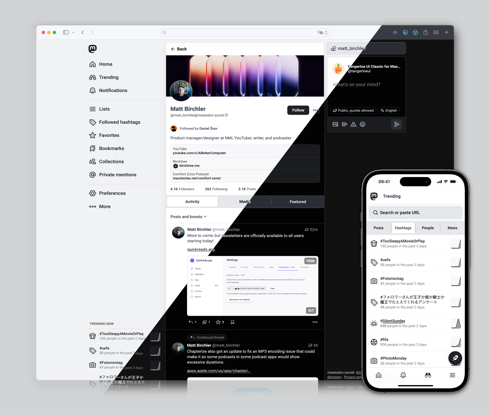
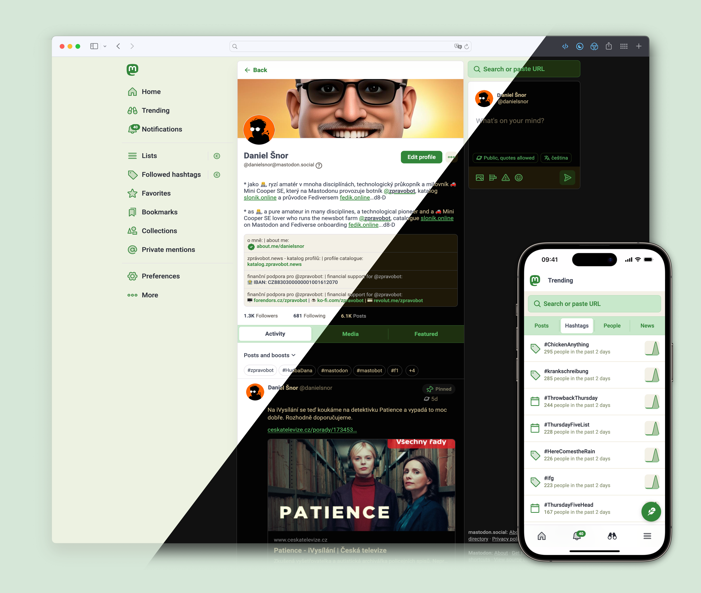
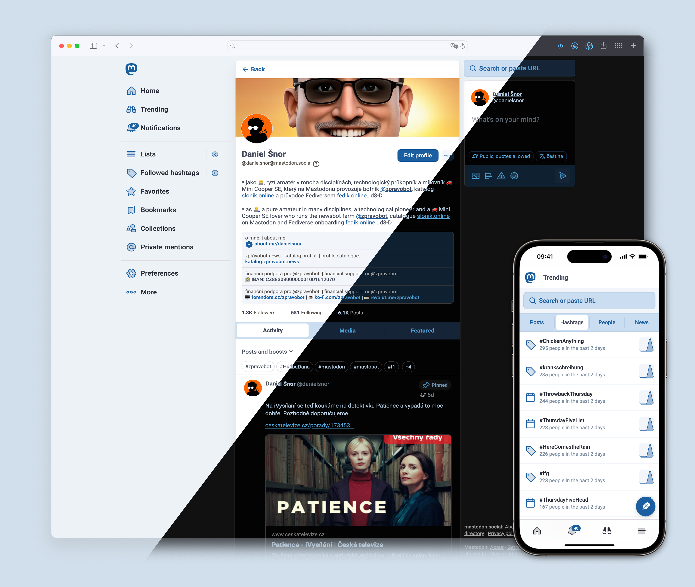

<h1>
 <picture>
  <source media="(prefers-color-scheme: dark)" srcset="./art/Logo_Wide_Dark.png?raw=true">
  <source media="(prefers-color-scheme: light)" srcset="./art/Logo_Wide.png?raw=true">
  
 </picture>
</h1>

TangerineUI Classic is a custom theme for Mastodon's Web UI, available in seven variants: 🍊 Tangerine, 🪻 Purple, 🍒 Cherry, 🐠 Lagoon, 🪨 Granite, 🌿 Garden, and 🌊 Ocean. It is a fork of [**Tangerine Neue**](https://github.com/mattbirchler/Tangerine-Neue-for-Mastodon) by [@matt_birchler](https://mastodon.social/@matt_birchler), which itself continued [**Tangerine UI for Mastodon**](https://github.com/nileane/TangerineUI-for-Mastodon) by [@nileane](https://nileane.fr/@nileane) after the original project [stopped being maintained](https://nileane.fr/@TangerineUI/116776620945959421).

This fork deliberately stays close to the original v2.5.x look and feel — flat surfaces, no motion "personality" — while keeping up with Mastodon 4.6+ compatibility.

## 0. Before we get too far…

All credit for the original design and the vast majority of the work belongs to [@nileane](https://nileane.fr/@nileane). Give [her a tip](https://ko-fi.com/nileane) if you like it!

Based on Tangerine Neue, maintained by [@matt_birchler@mastodon.social](https://mastodon.social/@matt_birchler).

Maintained by [@danielsnor@mastodon.social](https://mastodon.social/@danielsnor).

## 1. Table of contents

1. [**Table of contents**](#1-table-of-contents)
2. [**Overview**](#2-overview)  
      2.a [Variants](#2a-variants)  
      2.b [Features](#2b-features)  
      2.c [List of instances that use TangerineUI Classic](#2c-list-of-instances-that-use-tangerineui-classic)
3. [**Compatibility**](#3-compatibility)
4. [**Installation for Mastodon instance admins**](#4-installation-for-mastodon-admins)  
      4.a [Install as an optional theme on your instance \[Recommended\]](#4a-install-tangerineui-classic-as-an-optional-theme-on-your-instance-recommended)  
      4.b [Install as the only theme on your instance](#4b-install-tangerineui-classic-as-the-only-theme-on-your-instance)
6. [**Installation for regular users**](#5-installation-for-regular-users-non-mastodon-admins)
7. [**Accessibility**](#6-accessibility)
8. [**Development**](#7-development)
9. [**Credits**](#8-credits)
  
## 2. Overview

### 2.a Variants

**🍊 Tangerine**  
The default variant for TangerineUI Classic, it looks like a tangerine, of course.

  
&nbsp;


**🪻 Purple**  
For those of you who are cool with tangerines, but want to stick to Mastodon's purple.

  
&nbsp;


**🍒 Cherry**  
I won't be held responsible if you end up licking your screen because of this one.
  
  
&nbsp;


**🐠 Lagoon**  
Soft turquoise palette that gives neon vibes at night.

  
&nbsp;


**🪨 Granite**  
There's no way to sugar coat it, it's Tangerine for men, I'm so sorry.

  
&nbsp;


**🌿 Garden**  
Green and amber-gold, for those who'd rather be tending tomatoes than doomscrolling.

  
&nbsp;


**🌊 Ocean**  
Deep navy and sky blue, for a calmer scroll.

  
&nbsp;


### 2.b Features

🧑‍🔬 **Support for the advanced web interface**  
All variants of TangerineUI Classic support Mastodon's multi-column layout.
  
  


🚀 **Playful animations**  
The rocket flies!
  
  


<br>🌚 **Dark mode**  
TangerineUI Classic automatically switches from light to dark mode based on your system or browser preference.[^1]
[^1]: TangerineUI Classic uses the [`prefers-color-scheme`](https://developer.mozilla.org/en-US/docs/Web/CSS/@media/prefers-color-scheme) CSS media feature to detect if you have requested a light or dark theme through an operating system setting or a user agent setting.
  
💬 **Distinct look for DMs**  
It can be easy to mistake a DM for a regular post on Mastodon. TangerineUI Classic gives DMs a specific look, so they stand out in your timeline, and you don't make any embarrassing mistakes.

👁️ **Compact timeline**  
Avatars are aligned on the side, margins are properly reduced, and threads are easier to read.
  
✴️ **Phosphor icons**  
TangerineUI Classic uses a selection of icons from the beautiful [Phosphor](https://phosphoricons.com) icon family

🔍 **Zoom on emojis**  
  Custom emojis are great, but they may be difficult to distinguish when they are overly detailed. TangerineUI Classic allows you to hover and pause over an emoji to enlarge it.

✳️ **and more**  
TangerineUI Classic was designed with care and great attention to detail. Feel free to explore all the changes it brings to Mastodon's UI, and feel free to [message me](https://mastodon.social/@danielsnor) if you ever have any feedback to share or [bugs to report](https://github.com/DanielSnor/TangerineUI-Classic-for-Mastodon/issues). :)


### 2.c List of instances that use TangerineUI Classic

This is a list of known Mastodon instances on which TangerineUI Classic has been installed, either as the only theme or as an optional theme.[^2]
[^2]: If you're an admin and have installed TangerineUI Classic on your instance, **feel free to add yours to this list**. (Make a Pull Request, or just [DM me](https://mastodon.social/@danielsnor))

| **Instance**                                               | **User count** | **Installed as...** | **Default theme?**      |
| ---------------------------------------------------------- | -------------- | ------------------- | ----------------------- |
| [zpravobot.news](https://zpravobot.news)                   | 500+           | the only theme      | Yes (Tangerine variant) |

## 3. Compatibility
Which theme to use depends on your Mastodon version:

| Mastodon version       | What to use                                                                                                                                 |
| ---------------------- | ------------------------------------------------------------------------------------------------------------------------------------------- |
| **4.6 and later**      | ✅ [**Tangerine Neue**](https://github.com/mattbirchler/Tangerine-Neue-for-Mastodon/releases/latest) — the actively evolving upstream fork<br>✅ [**TangerineUI Classic**](https://github.com/DanielSnor/TangerineUI-Classic-for-Mastodon/releases/latest) — this fork, staying close to the original v2.5.x look and feel[^3][^4] |
| **4.5._x_**            | [**Tangerine UI for Mastodon**](https://github.com/nileane/TangerineUI-for-Mastodon) — the original theme; use it until you can upgrade to 4.6+ |
| **4.3._x_ – 4.4._x_**  | 🚫 Not supported by any version of the theme                                                                                                |
| **4.1._x_ – 4.2._x_**  | [**Tangerine UI Legacy** (v1.9)](https://github.com/nileane/TangerineUI-for-Mastodon/tree/legacy) only[^5][^6]                               |
| **4.0._x_ and older**  | 🚫 Not supported by any version of the theme                                                                                                |

[^3]: TangerineUI Classic (v2._x_) is also compatible with instances running a version of **Glitch-soc** based on the current stable release of Mastodon, as long as it is [installed as a vanilla theme](#4-installation-for-mastodon-admins) on these instances.
[^4]: Instances running on nightly/alpha/beta builds of Mastodon are not officially supported. If you do use TangerineUI Classic with an unstable version of Mastodon, feel free to [report](https://github.com/DanielSnor/TangerineUI-Classic-for-Mastodon/issues) UI issues as they appear. As a general rule, since the maintainer is on mastodon.social, it will tend to get updated to run whatever that instance is currently running.
[^5]: The advanced web interface (multi-column layout) is not supported by Tangerine UI Legacy (v1.9) and will fall back to Mastodon's default appearance if enabled.
[^6]: The Cherry variant is not available with Tangerine UI Legacy (v1.9).


## 4. Installation for Mastodon admins

There are two ways to install TangerineUI Classic on your Mastodon instance:

- as an **optional** theme \[Recommended\]
- as the **only** theme

### 4.a Install TangerineUI Classic as an optional theme on your instance [Recommended]:
Follow these instructions to install TangerineUI Classic as an optional theme on your Mastodon instance.  
Your users will be able to select TangerineUI Classic in their Appearance settings on the web.  
You will also be able to set TangerineUI Classic as the default theme for everyone on your instance, including logged out visitors.

<details>
<summary><strong>⚙️ Install (using the included script)</strong></summary>

A basic installation script is included in this repository.  
It can be used to install TangerineUI Classic on your Mastodon instance for the first time, and to automate the process of updating TangerineUI Classic.

Run the following commands as the `mastodon` user to install TangerineUI Classic using the [included script](https://github.com/DanielSnor/TangerineUI-Classic-for-Mastodon/blob/main/install.sh.sample):

1. **Clone** the TangerineUI Classic repository
```sh
git clone https://github.com/DanielSnor/TangerineUI-Classic-for-Mastodon.git ./TangerineUI
cd TangerineUI
```

2. **Copy** the sample install script.
```sh
cp install.sh.sample install.sh
```

Make sure the Mastodon directory path at the top of `install.sh` is correct:
  * Edit the line beginning with `MASTODON=` to adjust the path to your Mastodon installation directory.
  * The `TANGERINEUI=` path is detected automatically from the location of the script, so you normally don't need to change it.

3. **Run** the install script.
```sh
./install.sh
```

Alternatively:

* Run with `--skip-confirm` to bypass all confirmation prompts:
```sh
./install.sh --skip-confirm
```

* Run with `--main` if you wish to install by pulling from the latest commits on the main branch.  
(By default, the script will install the [latest stable release](https://github.com/DanielSnor/TangerineUI-Classic-for-Mastodon/releases/latest) of TangerineUI Classic.)
```sh
./install.sh --main
```

4. **Restart** your Mastodon instance for the changes to take effect.

Your users should now be able to choose '*Tangerine UI*', '*Tangerine UI (Purple)*', '*Tangerine UI (Cherry)*', '*Tangerine UI (Lagoon)*', '*Tangerine UI (Granite)*', '*Tangerine UI (Garden)*', or '*Tangerine UI (Ocean)*' as their site theme:


As an admin, you should also now be able to set TangerineUI Classic as the default theme for your instance (navigate to https://*domain*/admin/settings/appearance):


</details>


<details>
<summary><strong>⚙️ Install manually</strong></summary>

1. **Clone** the TangerineUI Classic repository, and fetch the [latest stable release](https://github.com/DanielSnor/TangerineUI-Classic-for-Mastodon/releases/latest) of TangerineUI Classic:
```sh
git clone https://github.com/DanielSnor/TangerineUI-Classic-for-Mastodon.git ./TangerineUI
cd TangerineUI
git checkout $(git describe --tags $(git rev-list --tags --max-count=1))
```

2. **Copy** the files from `mastodon/app/javascript/styles/` in the TangerineUI Classic repository to your Mastodon themes directory `app/javascript/styles/`:

```sh
# Replace $LIVE with the path to your Mastodon installation.
cp -r ./mastodon/app/javascript/styles/* $LIVE/app/javascript/styles
```

3. **Add localized names.** Copy the provided file located under `mastodon/config/locales/tangerineui.yml` in the TangerineUI Classic repository to your Mastodon locales directory. This will add localized names in a selection of languages for each variant of TangerineUI Classic.[^7]
[^7]: Mastodon will fallback to the English names for non-included locales.

```sh
# Replace $LIVE with the path to your Mastodon installation.
cp -r ./mastodon/config/locales/tangerineui.yml $LIVE/config/locales
```

4. **Add TangerineUI Classic to `themes.yml`**. So that TangerineUI Classic can be selected as an available option in your users' settings, you need to edit the `themes.yml` file located in your Mastodon installation under `config/themes.yml`. In this file, add 7 new lines, one for each variant of TangerineUI Classic, as follows:

```yml
default: styles/application.scss
contrast: styles/contrast.scss
mastodon-light: styles/mastodon-light.scss
tangerineui: styles/tangerineui.scss
tangerineui-purple: styles/tangerineui-purple.scss
tangerineui-cherry: styles/tangerineui-cherry.scss
tangerineui-lagoon: styles/tangerineui-lagoon.scss
tangerineui-granite: styles/tangerineui-granite.scss
tangerineui-garden: styles/tangerineui-garden.scss
tangerineui-ocean: styles/tangerineui-ocean.scss
```

5. **Compile** assets:
```sh
# Replace $LIVE with the path to your Mastodon installation.
cd $LIVE
RAILS_ENV=production bundle exec rails assets:precompile
```

6. **Restart** your Mastodon instance for the changes to take effect.

Your users should now be able to choose '*Tangerine UI*', '*Tangerine UI (Purple)*', '*Tangerine UI (Cherry)*', '*Tangerine UI (Lagoon)*', '*Tangerine UI (Granite)*', '*Tangerine UI (Garden)*', or '*Tangerine UI (Ocean)*' as their site theme:


As an admin, you should also now be able to set TangerineUI Classic as the default theme for your instance (navigate to https://*domain*/admin/settings/appearance):


   
</details>


<details>
<summary>⚙️ Install on a <strong>Glitch-soc instance</strong></summary>

TangerineUI Classic does not yet support Glitch-soc's features and layout, but it can still be installed as a vanilla skin on your Glitch-soc instance:

1. **Clone** the TangerineUI Classic repository, and fetch the [latest stable release](https://github.com/DanielSnor/TangerineUI-Classic-for-Mastodon/releases/latest) of TangerineUI Classic:
```sh
git clone https://github.com/DanielSnor/TangerineUI-Classic-for-Mastodon.git ./TangerineUI
cd TangerineUI
git checkout $(git describe --tags $(git rev-list --tags --max-count=1))
```

2. **Copy the files** from `mastodon/app/javascript/styles/` [in this repository](https://github.com/DanielSnor/TangerineUI-Classic-for-Mastodon/tree/main/mastodon/app/javascript/styles/) to your Mastodon themes directory `app/javascript/styles/`:

```sh
# Replace $LIVE with the path to your Mastodon Glitch-soc installation.
cp -r ./mastodon/app/javascript/styles/* $LIVE/app/javascript/styles
```

3. **Copy the files** from `mastodon/app/javascript/skins/vanilla/` [in this repository](https://github.com/DanielSnor/TangerineUI-Classic-for-Mastodon/tree/main/mastodon/app/javascript/skins/vanilla/) to your Glitch-soc skins directory `app/javascript/skins/vanilla/`:

```sh
# Replace $LIVE with the path to your Mastodon Glitch-soc installation.
cp -r ./mastodon/app/javascript/skins/vanilla/* $LIVE/app/javascript/skins/vanilla
```

4. **Compile** assets:
```sh
RAILS_ENV=production bundle exec rails assets:precompile
```

5. **Restart** your instance for the changes to take effect.

Your users should now be able to select TangerineUI Classic as a theme in their settings, under Flavours → Vanilla Mastodon → Skin


</details>

### 4.b Install TangerineUI Classic as the only theme on your instance:
1. **Check your Mastodon version**. For TangerineUI Classic to work properly, you need to make sure TangerineUI Classic is compatible with your Mastodon instance. Please refer to the [Compatibility](#3-compatibility) section in this document before you proceed.

2. Copy & paste the contents of 🍊 [`TangerineUI.css`](https://github.com/DanielSnor/TangerineUI-Classic-for-Mastodon/blob/main/TangerineUI.css) to the '***Custom CSS***' field in the administration panel on your Mastodon instance (Navigate to https://*domain*/admin/settings/appearance).
   * 🪻 For the Purple variant, copy the contents of [`TangerineUI-purple.css`](https://github.com/DanielSnor/TangerineUI-Classic-for-Mastodon/blob/main/TangerineUI-purple.css) instead.
   * 🍒 For the Cherry variant, copy the contents of [`TangerineUI-cherry.css`](https://github.com/DanielSnor/TangerineUI-Classic-for-Mastodon/blob/main/TangerineUI-cherry.css) instead.
   * 🐠 For the Lagoon variant, copy the contents of [`TangerineUI-lagoon.css`](https://github.com/DanielSnor/TangerineUI-Classic-for-Mastodon/blob/main/TangerineUI-lagoon.css) instead.
   * 🪨 For the Granite variant, copy the contents of [`TangerineUI-granite.css`](https://github.com/DanielSnor/TangerineUI-Classic-for-Mastodon/blob/main/TangerineUI-granite.css) instead.
   * 🌿 For the Garden variant, copy the contents of [`TangerineUI-garden.css`](https://github.com/DanielSnor/TangerineUI-Classic-for-Mastodon/blob/main/TangerineUI-garden.css) instead.
   * 🌊 For the Ocean variant, copy the contents of [`TangerineUI-ocean.css`](https://github.com/DanielSnor/TangerineUI-Classic-for-Mastodon/blob/main/TangerineUI-ocean.css) instead.

> [!WARNING]
> **Using the '*Custom CSS*' field to apply TangerineUI Classic will prevent all users on your instance from being able to choose another theme in their Appearance settings** ([see *Accessibility*](#6-accessibility)).  
> Please make sure there is a consensus among your users for doing so. If not, scroll back to the previous section ([4.a](#4a-install-tangerineui-classic-as-an-optional-theme-on-your-instance-recommended)) on how to install TangerineUI Classic as an optional theme for your users.


## 5. Installation for regular users (non Mastodon admins)
Even if you are not an admin on your instance, you can still use TangerineUI Classic with a browser extension:

1. **Check your Mastodon version**. For TangerineUI Classic to work properly, you need to make sure TangerineUI Classic is compatible with your Mastodon instance. Please refer to the [Compatibility](#3-compatibility) section in this document before you proceed.
2. **Install a browser extension** that allows you to inject CSS on a webpage, such as [Stylus](https://add0n.com/stylus.html), or [Live CSS Editor](https://github.com/webextensions/live-css-editor)
3. Copy & paste the contents of 🍊 [`TangerineUI.css`](https://github.com/DanielSnor/TangerineUI-Classic-for-Mastodon/blob/main/TangerineUI.css) to the extension's editor
   * 🪻 For the Purple variant, copy the contents of [`TangerineUI-purple.css`](https://github.com/DanielSnor/TangerineUI-Classic-for-Mastodon/blob/main/TangerineUI-purple.css) instead.
   * 🍒 For the Cherry variant, copy the contents of [`TangerineUI-cherry.css`](https://github.com/DanielSnor/TangerineUI-Classic-for-Mastodon/blob/main/TangerineUI-cherry.css) instead.
   * 🐠 For the Lagoon variant, copy the contents of [`TangerineUI-lagoon.css`](https://github.com/DanielSnor/TangerineUI-Classic-for-Mastodon/blob/main/TangerineUI-lagoon.css) instead.
   * 🪨 For the Granite variant, copy the contents of [`TangerineUI-granite.css`](https://github.com/DanielSnor/TangerineUI-Classic-for-Mastodon/blob/main/TangerineUI-granite.css) instead.
   * 🌿 For the Garden variant, copy the contents of [`TangerineUI-garden.css`](https://github.com/DanielSnor/TangerineUI-Classic-for-Mastodon/blob/main/TangerineUI-garden.css) instead.
   * 🌊 For the Ocean variant, copy the contents of [`TangerineUI-ocean.css`](https://github.com/DanielSnor/TangerineUI-Classic-for-Mastodon/blob/main/TangerineUI-ocean.css) instead.

> [!IMPORTANT]
> If you are a user on a Glitch-soc instance, you must switch to the Vanilla Mastodon flavour for TangerineUI Classic to work properly: in your instance settings, navigate to *Flavours* → *Vanilla Mastodon* → select the '*Default*' skin.

### Using a UserScript browser extension
If you prefer to use a UserScript browser extension, [@Write](https://github.com/Write) maintains a ready-to-use UserScript to load TangerineUI Classic on any Mastodon instance.

* Check out [the TangerineUI-Userscript repository](https://github.com/Write/TangerineUI-Userscript) for instructions.


## 6. Accessibility
Please consider that some of your users may depend on Mastodon's High Contrast theme before [setting TangerineUI Classic as the only theme](#4b-install-tangerineui-classic-as-the-only-theme-on-your-instance) on your instance. For this reason, unless you're running a single-user instance, I strongly recommend [installing TangerineUI Classic as an optional/revertable theme](#4a-install-tangerineui-classic-as-an-optional-theme-on-your-instance-recommended) instead.

TangerineUI Classic does support high contrast (Mastodon's High Contrast setting or the user's device setting), but some users will prefer to use the default Mastodon High Contrast theme instead.

## 7. Development

The seven `TangerineUI*.css` files (and their `.scss` installation copies under `mastodon/`) are **generated**, don't edit them directly. The source lives in `src/`:

- `src/template.css` - the shared theme; per-variant values appear as `{{placeholders}}`.
- `src/variants.mjs` - each variant's palette, logo, high-contrast brand colors, and meta.

After editing either, run `node src/build.mjs` (no dependencies, just Node) to regenerate all generated files (3 per variant: the top-level `.css`, and two `.scss` installation copies), then commit them. CI runs the build and fails if the committed output is out of date.

## 8. Credits
The logo for Tangerine UI was originally designed by [Younis @younishd](https://younishd.fr). 🍊!

As mentioned at the start, Tangerine UI was originally designed by [Niléane](https://nileane.fr/@nileane), and continued as Tangerine Neue by [@matt_birchler](https://mastodon.social/@matt_birchler).
